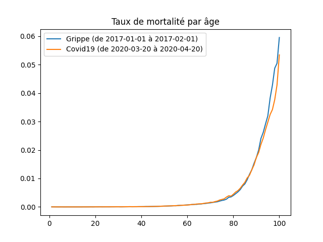

# c19frcheck

Little program to check moratlity rate in france due to covid19, and compare it to other periods.

The data are fetched automatically from official sources.

# how to run

```
# need python3
# with dependencies in requirements.txt
run.py all
```

# results


