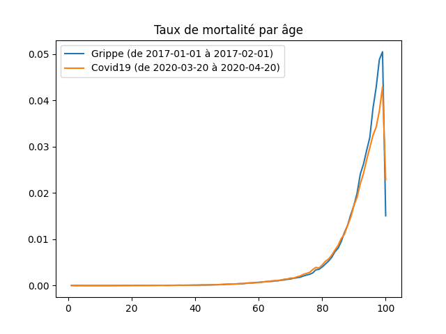

# c19frcheck

Programme visant à calculer le taux de mortalité du covid en France et de le comparer aux épidémies (de grippe) d'autres années.

Les données sontrécupérées automatiquement par le programme depuis des sources officielles.

# Résultats

On peut constater sur le graphe suivant que la première vague de Covid19 en France, a un taux de mortalité légèrement plus faible que l'épisode de grippe de janvier 2017:



Pourtant le nombre de décès totaux est supérieur pour la covid19:


Cette apparente différence s'explique par le fait que nous connaissons actuellement en France un vieillissement rapide de la population (phénomène connu sous le nom de "Papy Boom"). Le nombre de personne autour de 75 ans est en rapide augmentation, or cette tranche de la population est parmi celle qui est la plus vulnérable aux épidémies hivernales.


# Comment executer

```
# need python3
pip install -r requirements.txt
run.py all
```